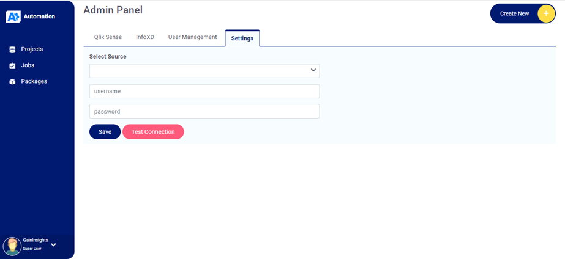
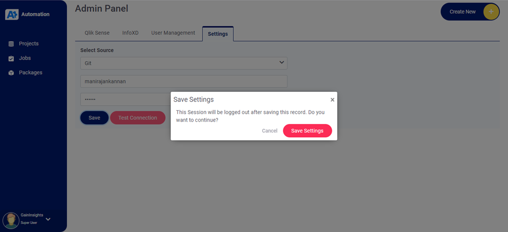

# Login
Users who have previously registered for the QS Automation application must login by:
 
    `Entering their User Name`
     
    `Entering their Password`
     
    `Selecting Login` 
     
to advance to the next screen and begin using the application.

## How to start the Application
* `Run the QS Automation instance`
* `Login with default username and password (helpgaininsights@gmail.com - Super User)`
* `After login with default username & password, user will be directed to Settings page of admin panel`
* `Here user needs to select the source and enter username and password`

* `Test Connection button is to test the connection of Selected source`
* `Save Button to save the record and that leads to log out`

* `Define the Qlik & InfoXD Servers Admin Panel`
 
  **`Login -> Admin Panel ->Qlik Sense/InfoXD tab -> Create New`**