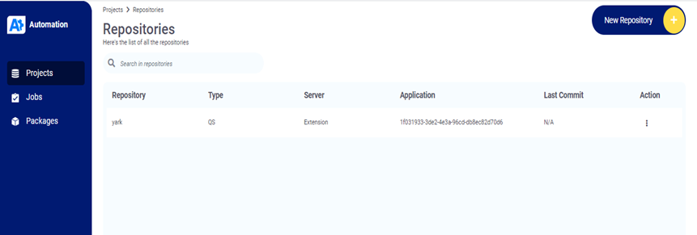
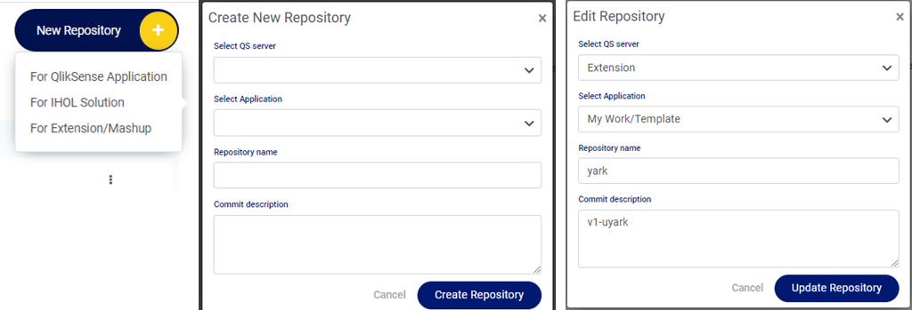
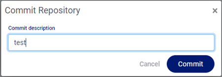
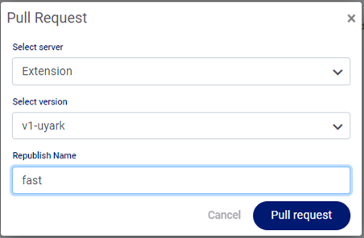
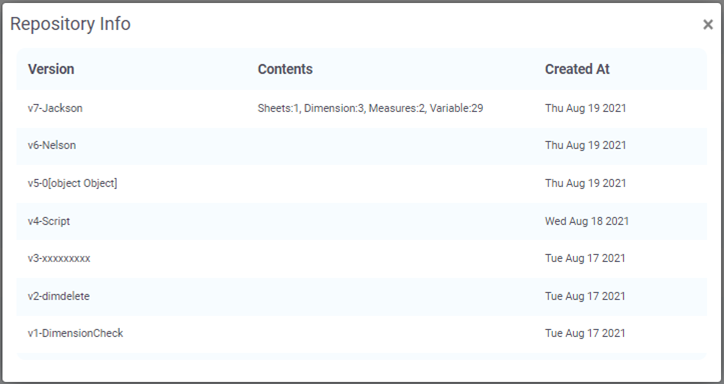

# Repositories
Repositories are nothing but a folder but in UI screen user can not able to view that.User can able to create the repository with name and description. There are three types of repositories are there.
## Types
* `QlikSense`
* `IHOL solution`
* `Extension / Mashups`
 

In this screen user can able to view all repositories along with the name, description, type and linked application

### New Repository Creation
There are three types of repo creations are there. Based on the selection screen will load the server list. The servers will load from defined server list which should be created earlier.Based on the server selection screen will load applications or extensions. Repository name and description should be filled manually and the description will act as first commit message

### Commit Repository
If any changes happened with the application or extensions which is linked with the repository, then this commit will capture all the changes and store with the new commit message. Each and every change will be recorded with description. In Action menu commit option is there, by clicking this one user can commit the data.
 
If no changes were there during the commit click, user will receive a message that “ No new files or changes to commit”. 

### Pull Request
Pull Request is an action which is used to pull (download) any version from current repository. Usually,the repository will be having multiple versions (commits) and this pull request will help the user to download any version and upload the same to any server with user’s preferred republish name. In Action menu pull request option is there, by clicking this one user can do this with server, version and republish name.

### Info
Info menu is having the details of all commits happened with repository. The info is having commit version,committed content and date.In Action menu Info option is there, by clicking this one user can get the details

